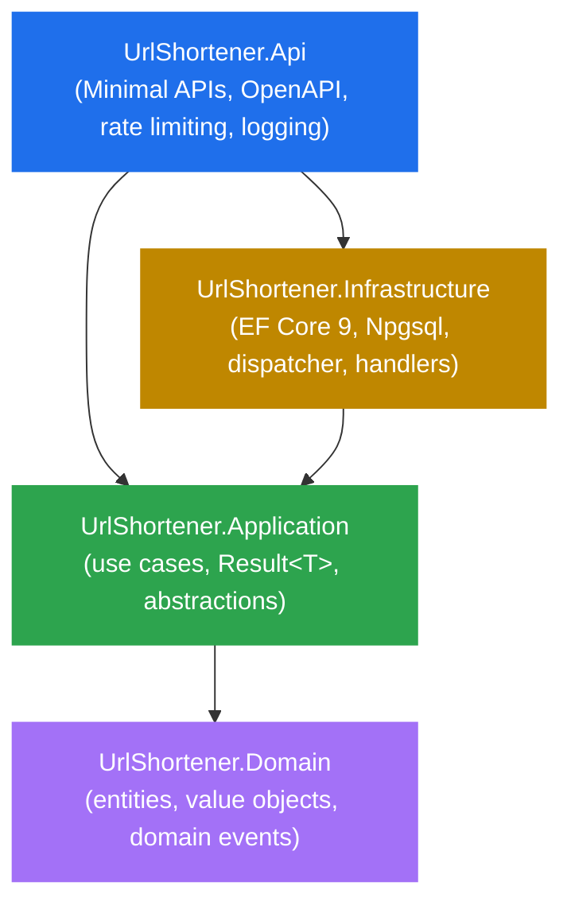

# url-shortener

[](https://github.com/jnvallejos/url-shortener/actions/workflows/ci.yml)

A reference URL shortener built end-to-end in .NET 9 to demonstrate Clean Architecture, Test-Driven Development, and modern .NET API practices. Every behavior is driven by tests; every dependency points inward. The repo is deliberately small in scope and large in care.

**Status: complete.** All five phases shipped: Domain, Application, Infrastructure, API, and CI/polish.

## Tech stack

- .NET 9, C# 13
- ASP.NET Core Minimal APIs, `Microsoft.AspNetCore.OpenApi`, `Scalar.AspNetCore`
- EF Core 9 (Npgsql for PostgreSQL in production, SQLite in-memory for tests)
- xUnit, FluentAssertions, Moq, `Microsoft.AspNetCore.Mvc.Testing`
- Microsoft.Extensions.DependencyInjection
- GitHub Actions for CI (build + test + coverage artifact on every push and PR)

## Quick start

```shell
git clone https://github.com/jnvallejos/url-shortener.git
cd url-shortener
dotnet restore
dotnet test
```

To run the API against PostgreSQL:

```shell
dotnet ef database update --project src/UrlShortener.Infrastructure --startup-project src/UrlShortener.Api
dotnet run --project src/UrlShortener.Api
```

The OpenAPI document is at `/openapi/v1.json` and Scalar UI at `/scalar/v1` in Development.

The connection string lives in `src/UrlShortener.Api/appsettings.json` and can be overridden via the `ConnectionStrings__DefaultConnection` environment variable.

## Architecture



```
url-shortener/
├── .github/
│   └── workflows/
│       └── ci.yml
├── docs/
│   ├── phase-1-spec.md
│   ├── phase-2-spec.md
│   ├── phase-3-spec.md
│   ├── phase-4-spec.md
│   └── phase-5-spec.md
├── src/
│   ├── UrlShortener.Domain/                    # zero external deps
│   │   ├── Common/                             # Entity, ValueObject, IDomainEvent
│   │   ├── Exceptions/                         # DomainException + concrete subtypes
│   │   ├── ShortUrls/                          # ShortUrl aggregate, ShortCode, OriginalUrl
│   │   │   └── Events/                         # ShortUrlClickedEvent
│   │   └── ClickAudits/                        # ClickAudit record
│   ├── UrlShortener.Application/               # depends on Domain
│   │   ├── Abstractions/                       # IShortUrlRepository, IShortCodeGenerator,
│   │   │                                       #   IDateTimeProvider, IDomainEventDispatcher
│   │   ├── Common/                             # Result<T>, Error, Errors catalogue
│   │   ├── DependencyInjection/                # AddApplication() extension
│   │   └── ShortUrls/
│   │       ├── Create/                         # CreateShortUrlUseCase + request/response
│   │       ├── GetByCode/                      # GetShortUrlUseCase + request/response
│   │       ├── Redirect/                       # RedirectUseCase + request/response
│   │       └── Admin/
│   │           ├── Disable/                    # DisableShortUrlUseCase + request/response
│   │           ├── Enable/                     # EnableShortUrlUseCase + request/response
│   │           └── UpdateExpiration/           # UpdateExpirationUseCase + request/response
│   ├── UrlShortener.Infrastructure/            # depends on Application
│   │   ├── Codes/                              # Base62ShortCodeGenerator (crypto RNG)
│   │   ├── DependencyInjection/                # AddInfrastructure(connectionString) extension
│   │   ├── Events/                             # DomainEventDispatcher, IDomainEventHandler
│   │   │   └── Handlers/                       # ShortUrlClickedEventHandler
│   │   ├── Persistence/                        # ApplicationDbContext, design-time factory
│   │   │   ├── Configurations/                 # ShortUrlConfiguration, ClickAuditConfiguration
│   │   │   ├── Migrations/                     # InitialCreate + model snapshot
│   │   │   └── Repositories/                   # EfShortUrlRepository
│   │   └── Time/                               # SystemDateTimeProvider
│   └── UrlShortener.Api/                       # depends on Application + Infrastructure
│       ├── Configuration/                      # RateLimitingOptions
│       ├── Contracts/                          # CreateShortUrlContract, ShortUrlContract,
│       │                                       #   ShortUrlStateContract, ShortUrlExpirationContract,
│       │                                       #   UpdateExpirationContract, ErrorResponse
│       ├── Endpoints/                          # ShortUrlsEndpoints, RedirectEndpoint
│       ├── ErrorMapping/                       # ErrorToHttpResultMapper (Error.Code → HTTP status)
│       └── Program.cs                          # hosting, DI wiring, rate limiter, OpenAPI, Scalar
├── tests/
│   ├── UrlShortener.Domain.Tests/              # 84 tests
│   ├── UrlShortener.Application.Tests/         # 93 tests, Moq-based
│   ├── UrlShortener.Infrastructure.Tests/      # 49 tests
│   │   ├── Codes/
│   │   ├── DependencyInjection/
│   │   ├── EndToEnd/                           # RedirectFlowIntegrationTests
│   │   ├── Events/
│   │   ├── Persistence/                        # incl. MigrationApplyTests
│   │   ├── TestSupport/                        # SqliteInMemoryFixture
│   │   └── Time/
│   └── UrlShortener.Api.Tests/                 # 57 tests (functional via WebApplicationFactory)
│       ├── Endpoints/                          # one test class per endpoint
│       ├── ErrorMapping/                       # ErrorToHttpResultMapperTests
│       ├── OpenApi/                            # OpenApiDocumentTests
│       ├── RateLimiting/                       # RedirectRateLimitTests
│       └── TestSupport/                        # ApiWebApplicationFactory, TestClock,
│                                               #   RateLimitedApiFactory, DevelopmentApiFactory
├── LICENSE
└── UrlShortener.sln
```

## HTTP endpoints

| Method | Path                                       | Use case          |
| ------ | ------------------------------------------ | ----------------- |
| POST   | `/api/shorturls`                           | CreateShortUrl    |
| GET    | `/{code}`                                  | Redirect          |
| GET    | `/api/shorturls/{code}`                    | GetShortUrl       |
| POST   | `/api/shorturls/{code}/disable`            | DisableShortUrl   |
| POST   | `/api/shorturls/{code}/enable`             | EnableShortUrl    |
| PATCH  | `/api/shorturls/{code}/expiration`         | UpdateExpiration  |

The redirect route is constrained to 7-character Base62 codes (`length(7):regex(^[A-Za-z0-9]+$)`) and protected by a fixed-window rate limiter (100 req/min per IP, configurable). Errors from the Application layer are mapped to HTTP status codes via `ErrorToHttpResultMapper`, switching on `Error.Code` (the stable contract) — never on the message text.

## Test coverage

283 tests, all green (2 functional tests skipped with documented justifications):

- 84 Domain unit tests
- 93 Application unit tests (Moq-based, sub-millisecond)
- 49 Infrastructure tests (mix of unit and integration with SQLite in-memory, including end-to-end redirect flow)
- 57 API functional tests via `WebApplicationFactory<Program>` (SQLite in-memory swap, controllable test clock, rate-limit and OpenAPI-document coverage)

## Why this design

**Clean Architecture with strict layer boundaries.** The Domain has zero external dependencies (not even `Microsoft.Extensions.*`). The Application depends only on the Domain. The Infrastructure depends on the Application abstractions. The API consumes both. This isn't ceremony — it's what makes the test pyramid honest: 84 of the 283 tests run against pure C# with no mocks of any infrastructure concern.

**Test-Driven Development with granular commits.** The commit log shows the red-green-refactor cycle: `test(...)` then `feat(...)` for each behavior. Reviewers can `git log --oneline` and follow the design as it emerged. No surprise commits where 500 lines land at once.

**Result pattern at the Application boundary.** Domain exceptions are caught inside use cases and converted to `Result<T>` with a stable `Error.Code`. The API maps codes to HTTP statuses by switch expression — never on message text or exception type. This means new error codes don't break the HTTP layer; missing mappings degrade to 500 explicitly.

**Domain events without an outbox.** Events are dispatched in-process after `SaveChangesAsync` succeeds, with the limitation that handler failures lose the event. The trade-off is documented in the Phase 2 spec; an outbox pattern would land if event durability became a real requirement.

**No MediatR, no AutoMapper, no FluentValidation.** Each adds a layer of indirection that small codebases pay for in cognition more than they save in code. Use cases are plain classes. Mapping is manual. Validation lives in value objects. The dependency list is short on purpose.

## Build and test

Run from repo root:

```shell
dotnet build
dotnet test
```

CI (`.github/workflows/ci.yml`) runs the same flow in `Release` configuration on every push to `main` and every pull request, collects Cobertura coverage with the XPlat collector, and uploads it as a workflow artifact.

## Run the API locally

The API targets PostgreSQL via the `DefaultConnection` connection string in `appsettings.json`. Apply the migration once before the first run:

```shell
dotnet ef database update --project src/UrlShortener.Infrastructure --startup-project src/UrlShortener.Api
dotnet run --project src/UrlShortener.Api
```

The API does not auto-migrate at startup by design (Phase 4 spec section 8.4). For a different connection string, override via the standard ASP.NET Core configuration env var: `ConnectionStrings__DefaultConnection`.

## Roadmap

Phase 5 (CI, polish, license) is complete. The repo is portfolio-ready.

## License

MIT — see [LICENSE](LICENSE).
