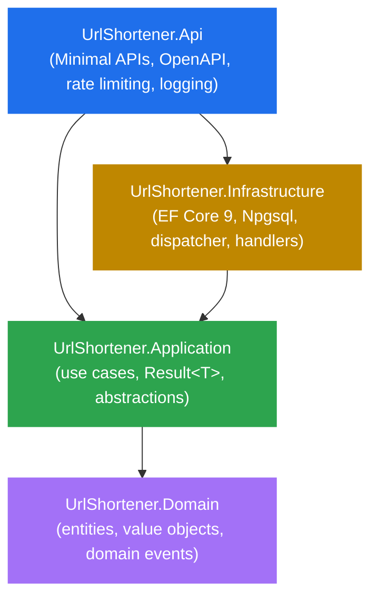

# Phase 5 Spec — Polish & CI (TDD where applicable)

**Repo:** `url-shortener`
**Domain:** URL Shortener
**Stack:** GitHub Actions, Mermaid (rendered by GitHub), Markdown
**Approach:** Mostly content + tooling. Granular commits, feature branch + PR.
**Branch:** `phase-5-polish`

---

## 1. Goal of Phase 5

Polish the repository for public consumption. No new production code, no new tests, no architectural changes. The output is a portfolio-ready repo that signals senior engineering at first glance.

At the end of Phase 5:
- GitHub Actions workflow runs `build` + `test` on every push to `main` and every PR
- README has a build status badge
- README is reorganized for the audience that lands on the repo cold (recruiters, Upwork clients, fellow engineers)
- README includes a Mermaid architecture diagram rendered by GitHub
- README includes a "Why this design" section explaining key decisions
- `LICENSE` file at repo root with MIT, 2026, "Javier Vallejos"
- Domain, Application, Infrastructure, Api code from Phases 1-4 is **untouched**

---

## 2. Solution & Folder Structure

```
url-shortener/
├── .github/
│   └── workflows/
│       └── ci.yml                        (NEW)
├── docs/
│   ├── phase-1-spec.md
│   ├── phase-2-spec.md
│   ├── phase-3-spec.md
│   ├── phase-4-spec.md
│   └── phase-5-spec.md                   (NEW)
├── src/                                  (unchanged)
├── tests/                                (unchanged)
├── LICENSE                               (NEW)
├── README.md                             (REPLACED)
├── UrlShortener.sln                      (unchanged)
├── .editorconfig                         (unchanged)
└── .gitignore                            (unchanged)
```

No new src/ or tests/ projects. Only `.github/workflows/ci.yml`, `LICENSE`, the rewritten `README.md`, and the new spec file.

---

## 3. GitHub Actions Workflow

### 3.1 File: `.github/workflows/ci.yml`

```yaml
name: CI

on:
  push:
    branches: [main]
  pull_request:
    branches: [main]

jobs:
  build-and-test:
    name: Build and test
    runs-on: ubuntu-latest

    steps:
      - name: Checkout
        uses: actions/checkout@v4

      - name: Setup .NET
        uses: actions/setup-dotnet@v4
        with:
          dotnet-version: 9.0.x

      - name: Restore dependencies
        run: dotnet restore

      - name: Build
        run: dotnet build --no-restore --configuration Release

      - name: Test
        run: dotnet test --no-build --configuration Release --verbosity normal --collect:"XPlat Code Coverage" --results-directory ./TestResults

      - name: Upload coverage report
        if: always()
        uses: actions/upload-artifact@v4
        with:
          name: coverage-report
          path: ./TestResults/**/coverage.cobertura.xml
          retention-days: 30
```

**Decisions:**
- **Single job, single OS (Ubuntu latest).** No matrix. Faster CI = CI that gets read. The codebase has no platform-specific code.
- **`actions/setup-dotnet@v4`** uses the SDK version 9.0.x. Pinning the major.minor lets patch updates apply automatically.
- **`--configuration Release`** in build and test. Closer to what would ship, catches Release-only issues (rare but real with C# nullable analyzers and EF compile-time codegen).
- **`--no-restore` and `--no-build`** in subsequent steps. Avoids redundant work; the `restore` step did it once.
- **Code coverage with XPlat collector.** Built into .NET, no extra package. Cobertura format is the de-facto standard.
- **`if: always()`** on the upload step. Coverage uploaded even when tests fail, so we can see what was hit before the failure.
- **30-day retention** on coverage artifact. Default is 90; 30 is enough and saves storage.
- **No publish, no deploy.** This is CI, not CD. Phase 5 doesn't deploy anywhere.

### 3.2 What the workflow does NOT do

Explicitly out of scope:
- **No matrix build** (Windows + Mac + Ubuntu). Adds 2-3x time, zero portfolio value.
- **No third-party coverage upload** (Codecov, Coveralls). They require accounts, tokens, and add complexity. The artifact is enough.
- **No deploy / release / NuGet publish.** This is a portfolio repo, not a published library.
- **No CodeQL / security scanning.** Phase 6+ if ever needed.
- **No Docker build.** Out of scope.
- **No notifications (Slack, email).** GitHub itself notifies on PRs and failed runs.

---

## 4. Build Status Badge

### 4.1 Markdown for the badge

```markdown
[](https://github.com/jnvallejos/url-shortener/actions/workflows/ci.yml)
```

The badge URL pattern is GitHub's standard:
- `https://github.com/{owner}/{repo}/actions/workflows/{filename}/badge.svg` for the image
- `https://github.com/{owner}/{repo}/actions/workflows/{filename}` for the link

### 4.2 Placement

The badge appears as the **first line below the H1 title** in `README.md`, before any prose.

```markdown
# url-shortener

[](https://github.com/...)

A .NET 9 reference implementation...
```

This is the standard convention. Badge above the fold, visible without scrolling.

---

## 5. LICENSE File

### 5.1 Content

Standard MIT license, year 2026, copyright "Javier Vallejos". Verbatim:

```
MIT License

Copyright (c) 2026 Javier Vallejos

Permission is hereby granted, free of charge, to any person obtaining a copy
of this software and associated documentation files (the "Software"), to deal
in the Software without restriction, including without limitation the rights
to use, copy, modify, merge, publish, distribute, sublicense, and/or sell
copies of the Software, and to permit persons to whom the Software is
furnished to do so, subject to the following conditions:

The above copyright notice and this permission notice shall be included in all
copies or substantial portions of the Software.

THE SOFTWARE IS PROVIDED "AS IS", WITHOUT WARRANTY OF ANY KIND, EXPRESS OR
IMPLIED, INCLUDING BUT NOT LIMITED TO THE WARRANTIES OF MERCHANTABILITY,
FITNESS FOR A PARTICULAR PURPOSE AND NONINFRINGEMENT. IN NO EVENT SHALL THE
AUTHORS OR COPYRIGHT HOLDERS BE LIABLE FOR ANY CLAIM, DAMAGES OR OTHER
LIABILITY, WHETHER IN AN ACTION OF CONTRACT, TORT OR OTHERWISE, ARISING FROM,
OUT OF OR IN CONNECTION WITH THE SOFTWARE OR THE USE OF OTHER DEALINGS IN THE
SOFTWARE.
```

### 5.2 Decisions

- **MIT, not Apache 2.0 or GPL.** MIT is the most permissive, most recognizable, and matches what the README has been promising since Phase 1. Switching now would be inconsistent.
- **2026, single year.** Some repos use ranges like "2024-2026"; this one started in 2026. Single year is correct.
- **"Javier Vallejos", not a noreply email or alias.** Real name on the LICENSE is standard.
- **No `[year]`, `[fullname]` placeholder syntax left over.** Render the actual values.

GitHub auto-detects the LICENSE file and shows "MIT" on the repo home page sidebar. That's the visible payoff.

---

## 6. README Rewrite

The current README (post Phase 4) is good but written incrementally as the project grew. Phase 5 rewrites it for an audience that arrives cold and has 60 seconds.

### 6.1 Section order (final)

```
[H1 title]
[Build badge]

[Hook paragraph: 2-3 sentences, what it is, what it demonstrates, why it matters]

## Tech stack

## Quick start

## Architecture
  [Mermaid diagram]
  [Folder tree, kept]

## HTTP endpoints
  [Table, kept]

## Test coverage

## Why this design
  [New section, see 6.4]

## Build and test

## Run the API locally

## Roadmap (collapsed: just "Phase 5: complete. Repo is portfolio-ready.")

## License
```

### 6.2 Hook paragraph

The first prose under the badge. Three sentences, no buzzwords:

```
A reference URL shortener built end-to-end in .NET 9 to demonstrate Clean
Architecture, Test-Driven Development, and modern .NET API practices. Every
behavior is driven by tests; every dependency points inward. The repo is
deliberately small in scope and large in care.
```

The third sentence is the one that signals craft. Reviewers who skim catch it.

### 6.3 Mermaid architecture diagram

GitHub renders Mermaid in Markdown natively. The diagram replaces the need for an image asset:

````

````

**Decisions:**
- **Mermaid `graph TD`** (top-down). Top is consumer (Api), bottom is core (Domain). Matches the dependency direction visually.
- **Color coding** by layer. GitHub-friendly hex colors (the same blue/yellow/green/purple GitHub uses on its own UI), white text for contrast.
- **Annotations on each node** with the key responsibilities of that layer. One-liners. Reading the diagram alone tells the architecture story.
- **The folder tree from the post-Phase-4 README is kept** below the diagram. Diagram for impact, tree for detail.

### 6.4 "Why this design" section

A new section that didn't exist before. Format: 5 brief justifications, each one paragraph max.

```markdown
## Why this design

**Clean Architecture with strict layer boundaries.** The Domain has zero
external dependencies (not even `Microsoft.Extensions.*`). The Application
depends only on the Domain. The Infrastructure depends on the Application
abstractions. The API consumes both. This isn't ceremony — it's what makes
the test pyramid honest: 84 of the 283 tests run against pure C# with no
mocks of any infrastructure concern.

**Test-Driven Development with granular commits.** The commit log shows the
red-green-refactor cycle: `test(...)` then `feat(...)` for each behavior.
Reviewers can `git log --oneline` and follow the design as it emerged. No
surprise commits where 500 lines land at once.

**Result pattern at the Application boundary.** Domain exceptions are
caught inside use cases and converted to `Result<T>` with a stable
`Error.Code`. The API maps codes to HTTP statuses by switch expression —
never on message text or exception type. This means new error codes don't
break the HTTP layer; missing mappings degrade to 500 explicitly.

**Domain events without an outbox.** Events are dispatched in-process after
`SaveChangesAsync` succeeds, with the limitation that handler failures lose
the event. The trade-off is documented in the Phase 2 spec; an outbox
pattern would land if event durability became a real requirement.

**No MediatR, no AutoMapper, no FluentValidation.** Each adds a layer of
indirection that small codebases pay for in cognition more than they save
in code. Use cases are plain classes. Mapping is manual. Validation lives
in value objects. The dependency list is short on purpose.
```

These five points are the meta-narrative reviewers want to see. Each one says "I know this style exists, I considered it, I chose this instead, here's why."

### 6.5 Quick start section

Replaces the current "Build and test" + "Run the API locally" with a unified flow:

```markdown
## Quick start

```shell
git clone https://github.com/jnvallejos/url-shortener.git
cd url-shortener
dotnet restore
dotnet test
```

To run the API against PostgreSQL:

```shell
dotnet ef database update --project src/UrlShortener.Infrastructure --startup-project src/UrlShortener.Api
dotnet run --project src/UrlShortener.Api
```

The OpenAPI document is at `/openapi/v1.json` and Scalar UI at `/scalar/v1`
in Development.
```

The connection string lives in `src/UrlShortener.Api/appsettings.json` and can be overridden via the `ConnectionStrings__DefaultConnection` environment variable.

### 6.6 Roadmap section

Collapsed to a single line:

```markdown
## Roadmap

Phase 5 (CI, polish, license) is complete. The repo is portfolio-ready.
```

No more bullet list of remaining phases. The status header at the top of the README also gets updated:

```
**Status: complete.** All five phases shipped: Domain, Application,
Infrastructure, API, and CI/polish.
```

### 6.7 License section

```markdown
## License

MIT — see [LICENSE](LICENSE).
```

The link is to the file in the same directory. GitHub renders this as a clickable link that opens the LICENSE file inline.

---

## 7. Commit Convention — Phase 5

Same Conventional Commits as previous phases. Scopes used:

- `ci`: anything inside `.github/workflows/`
- `repo`: repo-level files like `LICENSE`
- `docs`: README rewrite, spec file

No `domain`, `application`, `infrastructure`, or `api` scopes appear in this phase. Source code is untouched.

**Granularity rule unchanged.** One logical concept per commit.

**Example commit sequence (illustrative):**

```
chore(ci): add github actions workflow for build and test
docs(repo): add phase 5 progress note to readme
chore(repo): add MIT license file
docs: rewrite readme with mermaid diagram and design rationale
docs: add phase 5 spec
```

The actual ordering may differ slightly. The spec file (`docs/phase-5-spec.md`) lands wherever it makes sense in the flow.

---

## 8. What NOT to Do in Phase 5

- **Do not** modify Domain, Application, Infrastructure, or Api source code. The four phases of code are frozen.
- **Do not** add new tests. Phase 5 is content + tooling.
- **Do not** add NuGet packages anywhere. The package list is closed.
- **Do not** add a Dockerfile or `docker-compose.yml`. Out of scope.
- **Do not** add a deploy step to the workflow. CI ≠ CD here.
- **Do not** add a release workflow (`on: push: tags: 'v*'`) for NuGet/GitHub releases. This is a portfolio repo, not a published library.
- **Do not** add Dependabot or Renovate config files. They add maintenance noise without value for a static portfolio repo.
- **Do not** add issue templates, PR templates, or contributing guides. The repo is a one-person portfolio piece, not an OSS project soliciting contributions.
- **Do not** add badges beyond CI status. (No code coverage badge, no .NET version badge, no license badge — they clutter without informing. The README's prose covers this.)
- **Do not** add a code of conduct. Same reason: not an OSS community repo.
- **Do not** add Codecov or Coveralls integration. Coverage is uploaded as a workflow artifact and that's enough.
- **Do not** modify `.editorconfig` or `.gitignore`. They've been correct since Phase 1 and Phase 3 respectively.
- **Do not** rename branches, repos, or anything URL-affecting. Existing PR links and badge URLs depend on stability.
- **Do not** add a "Contributors" section, GitHub social previews (image), or any embellishment that would feel like dressing up a portfolio. The code speaks for itself; meta-decoration is noise.
- **Do not** publish a deployed demo (Render, Railway, fly.io). Free tiers are unstable; a broken demo link is worse than no demo.
- **Do not** auto-merge or auto-close anything. The PR for Phase 5 still requires manual review and merge, same convention as Phases 2-4.

---

## 9. Acceptance Criteria for Phase 5 Completion

Before opening the PR:

- [ ] `.github/workflows/ci.yml` exists and passes a syntax check (`actionlint` if available, or visual inspection)
- [ ] `LICENSE` file at repo root with MIT text, 2026, "Javier Vallejos"
- [ ] `README.md` rewritten with the section order in 6.1
- [ ] Build status badge on first line below H1
- [ ] Mermaid architecture diagram renders correctly when previewed on GitHub (test in the PR view)
- [ ] "Why this design" section present with the five points from 6.4
- [ ] Status header updated to "complete"
- [ ] Roadmap section collapsed to one line
- [ ] `docs/phase-5-spec.md` committed
- [ ] Source code in `src/` and `tests/` is **unchanged** in this PR's diff (verified by `git diff main..phase-5-polish -- src/ tests/` returning empty)
- [ ] Existing files unchanged: `.editorconfig`, `.gitignore`, `UrlShortener.sln`
- [ ] Commit history is granular and follows section 7 convention
- [ ] No NuGet packages added anywhere
- [ ] PR opened on branch `phase-5-polish` against `main`, NOT merged

After the PR is merged:
- [ ] CI workflow runs on the merge commit and passes (visible in the badge turning green)
- [ ] GitHub repo home page shows "MIT" license in the right sidebar (auto-detected from LICENSE file)

---

## 10. Branch & PR Workflow — Phase 5

Identical to Phases 2-4. Summary:

1. `git checkout -b phase-5-polish` from `main` before the first commit.
2. Commit on the branch following section 7.
3. Push: `git push -u origin phase-5-polish`.
4. Open a PR via `gh pr create --base main --head phase-5-polish --title "Phase 5: CI and Polish"` with body containing:
   - Summary paragraph
   - Acceptance criteria checklist from section 9
   - Note that source code (src/, tests/) is intentionally untouched
   - "Repo is portfolio-ready after this PR is merged" — explicit statement
5. Do NOT merge.
6. Report: "Phase 5 complete. PR opened: <URL>. Acceptance criteria checked. Awaiting review." and stop.

---

## 11. After Phase 5 Merges

- The repo's status changes from "work in progress" to "complete".
- The README reflects the final state.
- The CI badge turns green on the merge commit, visible at the top of the README.
- "MIT" appears in the GitHub repo sidebar.
- No further code is planned. If specific feature requests arise (auth, multi-tenancy, deploy, etc.), each becomes its own discussion — they're not Phase 6 by default.

This is the end of the planned work. The repo serves its purpose: portfolio piece for senior .NET engineering with disciplined Clean Architecture and TDD.
